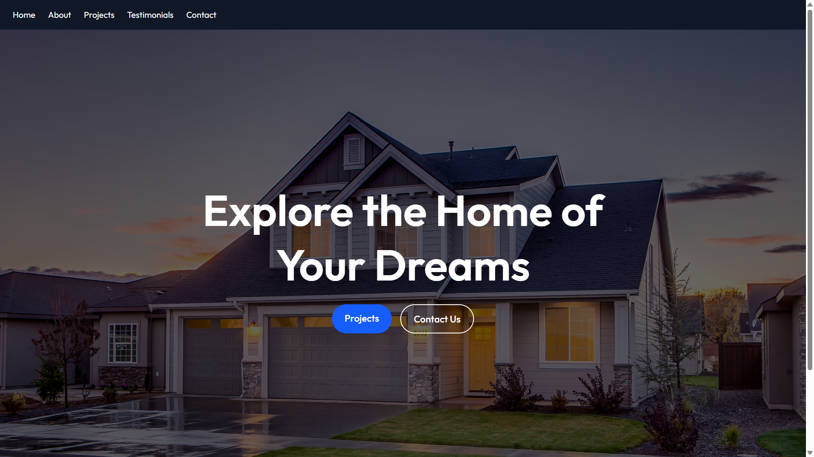
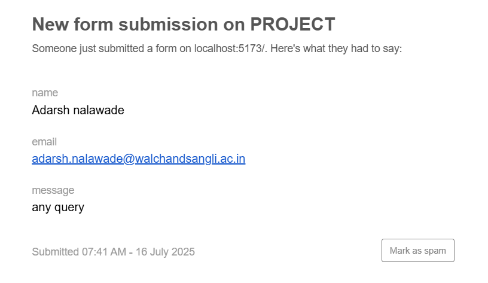
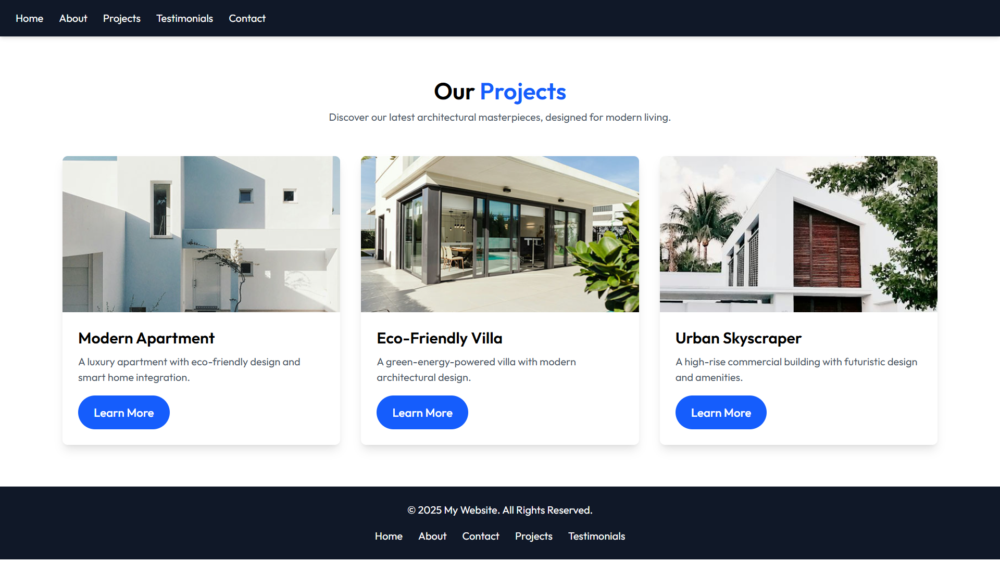

# 🏡 Real Estate Website — React + Vite

This is a modern Real Estate web application built using **React**, **Vite**, and **Tailwind CSS**.

It provides a fast development setup with **hot module replacement (HMR)**, ESLint integration, and GitHub Pages deployment support.

---

## ⚙️ Tech Stack

- 🔥 [Vite](https://vitejs.dev/) — Lightning-fast build tool
- ⚛️ [React](https://reactjs.org/)
- 💨 [Tailwind CSS](https://tailwindcss.com/)
- 🛠️ [ESLint](https://eslint.org/)
- 🚀 GitHub Pages for deployment

---

## 🔌 Vite React Plugins

This template currently supports two official Vite plugins for React:

- [`@vitejs/plugin-react`](https://github.com/vitejs/vite-plugin-react/blob/main/packages/plugin-react/README.md)  
  ➤ Uses [Babel](https://babeljs.io/) for **Fast Refresh** and JSX transformation.

- [`@vitejs/plugin-react-swc`](https://github.com/vitejs/vite-plugin-react-swc)  
  ➤ Uses [SWC](https://swc.rs/) for even faster **Fast Refresh** and JSX transformation.

👉 You can choose either based on your performance and tooling preferences.

---

## 🖼️ Website Screenshots

### 🏠 Home Page


### 📂 Projects


### 📱 Responsive View


### ℹ️ About Section


### 📬 Contact Form


### 📬 Contact Form (Alt)


## 📦 Setup Instructions

```bash
# Install dependencies
npm install

# Start dev server
npm run dev

# Build for production
npm run build

# Deploy to GitHub Pages
npm run deploy
